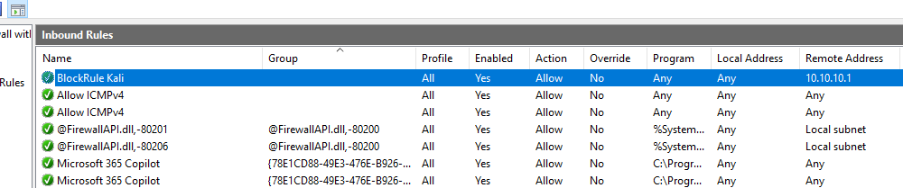
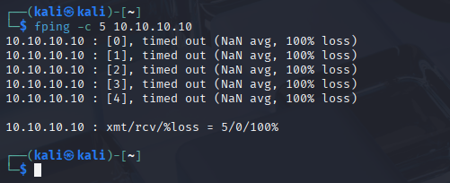

# 1.1 – Security Controls

**CompTIA Security+ SY0-701 – Exam Objective 1.1**
**Source video:** Professor Messer – Security Controls

## What This Covers

A security control can be described two ways:
- **Category** – what enforces it
- **Type** – when or how it acts

### Categories

| Category | Enforced by |
|---|---|
| Technical | A system or piece of software |
| Managerial | Written policy or procedure |
| Operational | People, on a day-to-day basis |
| Physical | Something that limits physical access |

### Types

| Type | What it does |
|---|---|
| Preventive | Stops an event before it happens |
| Deterrent | Discourages an attempt, without fully blocking it |
| Detective | Identifies an event during or after it happens |
| Corrective | Fixes or limits the damage once an event has happened |
| Compensating | A stand-in control, used when the main one isn't possible yet |
| Directive | Tells people what to do; relies on them following it |

## Lab Environment

Reuses the existing home lab from [cybersecurity-home-lab](https://github.com/EnumaElish9999/cybersecurity-home-lab):

- **Kali** – 10.0.2.15 (NAT) / 10.10.10.1 (internal, also acting as gateway)
- **Windows 10** – 10.10.10.10 (internal network 10.10.10.0/24)

## Practical Exercise

One task per control type — six in total, mixing technical, physical, and managerial examples.

### 1. Preventive (Technical) – Firewall rule

**Goal:** Block a port on Windows 10 so Kali can't reach it.

#### Ping Windows

Opened Windows Defender Firewall with Advanced Security on Windows 10 and
added an inbound rule blocking ICMP Echo Request from Kali.

#### Ping Timed Out

### 2. Deterrent (Physical) – Warning label

**Goal:** Show a physical example that discourages rather than blocks.

- Make a short label for the lab setup, e.g. "Private lab – do not power off"
- Photograph it next to the equipment
- **Capture:** the photo, plus one line on why this deters rather than prevents

### 3. Detective (Technical) – Audit logging

**Goal:** Detect an event after it happens.

- On Windows 10, enable logon auditing via Local Security Policy (`secpol.msc` → Local Policies → Audit Policy)
- Trigger a failed logon on purpose
- Find the matching entry in Event Viewer
- **Capture:** a screenshot of the Event Viewer entry, with the Event ID noted

### 4. Corrective (Technical) – Snapshot restore

**Goal:** Show recovery after an incident.

- With a clean snapshot already taken, break something on purpose (e.g. change the IP so Windows 10 loses network access)
- Confirm it's broken
- Restore the snapshot
- Confirm it's fixed
- **Capture:** before/after screenshots

### 5. Compensating (Technical) – Temporary block

**Goal:** Show a stand-in control for something that can't be patched right away.

- Pick a service to treat as "unpatched" (e.g. SMB, port 445)
- Block access to it with a firewall rule instead of fixing the underlying issue
- **Capture:** the rule, plus a short note on why this is compensating and not preventive

### 6. Directive (Managerial) – Short policy note

**Goal:** Write an actual policy-based control, not a technical one.

- Write a half-page note on handling sensitive data — e.g. where files should be stored, what shouldn't go on personal USB drives
- Save it in this folder as `data-handling-note.md`
- **Capture:** the file itself

## Results

_Fill in after each exercise: what you did, what you saw, any issues you hit._

## Key Takeaways

_Fill in after finishing: 2–3 sentences on what this taught you._
